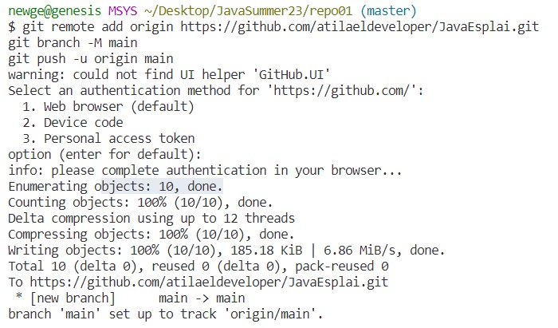

# Ejercicio 1 de repositorios  

1.1 Primero hemos creado un directorio llamado repo01 

+ Hemos creado la carpeta repo1, cometimos el error al llamarla “repo1” y no “repo01”  
+ Usamos el comando “mv” para cambiar el nombre, sin embargo lo habiamos hecho manualmente  
+ Con el comando “ls” vemos que el nombre ya esta cambiado

+ Con el comando “git init nombre_carpeta” hemos convertido a la carpeta “repo01” a un repositorio GIT.

+ Hay dos formas de comprobar que estamos dentro de un repositorio:
  
  + La primera es ver la carpeta oculta dentro del nuevo repositorio llamado “.git”:
  

+ La segunda es entrando desde la terminal GIT bash a la carpeta del repositorio y ver que en el nombre nos aparece una nomenclatura adicional titulada “master”, eso indica que estamos en la rama principal del repositorio.

1.2 Creacion MarkDown

+ Primero hemos creado el archivo MarkDown

1.3 Ahora añadiremos el fichero a la staging area

  1. Primero vemos el estado del repositorio con la comanda **git status**. Aqui comprobamos la existencia y ubicacion del archivo markdown.

  2. Luego hemos añadido con el comando **git add .** todos los directorios, archivos, etc, del directorio. Hemos usado el "." para añadir todo.  
   .

  3. Ahora con un **git status** podemos ver el estado actual y como se diferencia del estado anterior.
   
  4. Posteriormente usamos el comando **git commit -m "nombre_archvios"** y subimos al Git nuestro proyecto

Ahora nuestro fichero se encuenta en la fase de "Local Repository"

+ Aqui abajo podemos ver el historial de los commits hechos con **git log"**
    

1.4 Subiendo con Git Push

+ Intentamos subir nuestro archivo mediante el comando **git push** ,  pero este no nos deja debido a que no tenemos un repositorio remoto configurado.

+ Para hacerlo correctamente tenemos que crear un repositorio en GitHub y enlazarlo a nuestro repositorio local

1.5 Usamos **git remote -v**

+ No nos aparece nada debido a que no hay ningun repositorio asociado.
1.6 Creamos un repositorio en GitHub llamado repo01

+ Vemos que en la terminal se ha actualizado de forma automática la conexion con GitHub

1.7 Ahora volvemos a usar el comando **git remote -v**  

+ Ahora vemos que si que nos aparece más informacion que antes 